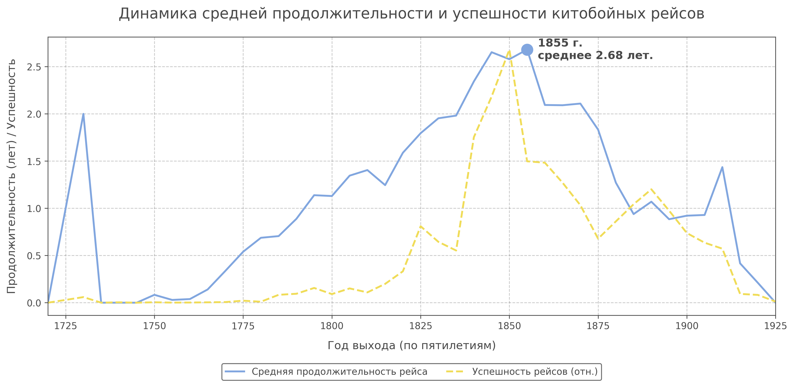
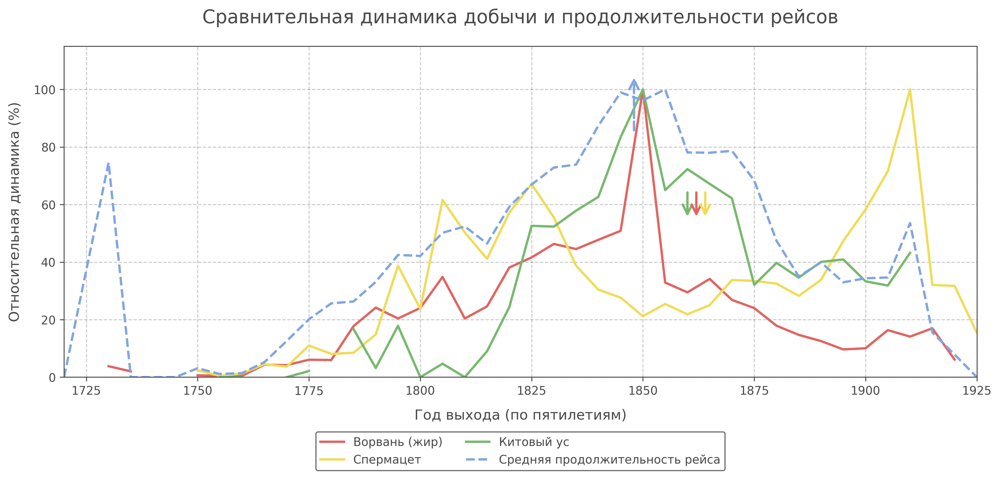

# Adalympics

## Описание исследования

## Результаты визуализации



---



---

## Инструкция по запуску
Для генерации графиков и отчета необходимо выполнить следующие команды:
```sh
just run
```

### Требования
- [Пакетный менеджер uv](https://docs.astral.sh/uv/)
- [Командный раннер just](https://github.com/casey/just)
